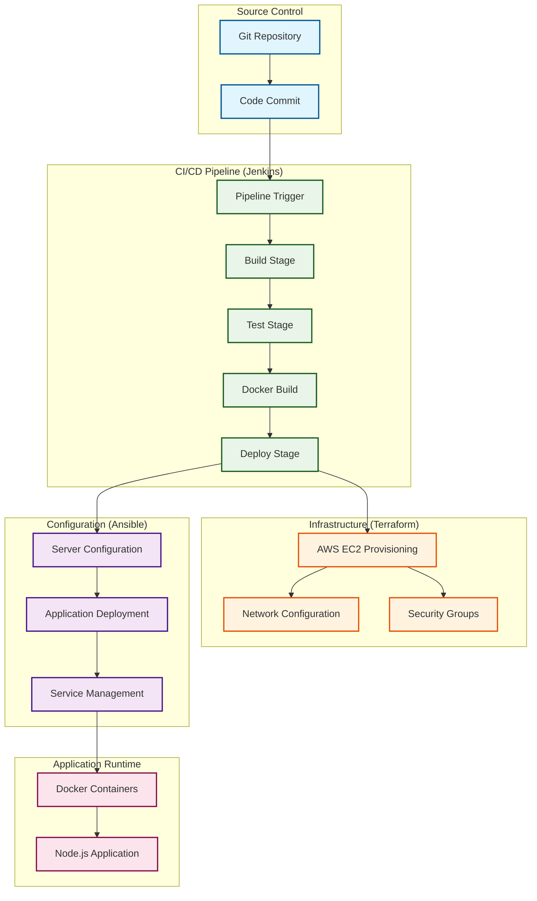

# Complete CI/CD Pipeline
## DevOps Automation with Jenkins, Terraform, Ansible & Docker

[](https://www.jenkins.io/)
[](https://www.docker.com/)
[](https://www.ansible.com/)
[](https://www.terraform.io/)
[](https://aws.amazon.com/)
[](https://nodejs.org/)
[](https://developer.mozilla.org/en-US/docs/Web/JavaScript)
[](https://groovy-lang.org/)
[](https://expressjs.com/)
[](https://jestjs.io/)

> A complete CI/CD pipeline implementation demonstrating DevOps automation practices with Infrastructure as Code, configuration management, containerization, and automated deployment on AWS.

## 🚀 Overview

This project demonstrates a practical CI/CD pipeline that automates the software delivery process from code commit to production deployment. It showcases the integration of popular DevOps tools including Jenkins for CI/CD orchestration, Terraform for infrastructure provisioning, Ansible for configuration management, and Docker for containerization.

### ✨ Key Components

- **🔄 Jenkins Pipeline**: Automated CI/CD pipeline with Groovy scripting
- **🏗️ Terraform Infrastructure**: AWS infrastructure provisioning and management
- **⚙️ Ansible Configuration**: Server configuration and application deployment automation
- **🐳 Docker Containerization**: Application packaging and containerized deployment
- **☁️ AWS Integration**: Cloud infrastructure with EC2 instances and dynamic inventory
- **🧪 Automated Testing**: Jest-based testing integration in the pipeline
- **📦 Sample Application**: Node.js/Express.js web application for demonstration

## 🏗️ Architecture Overview



## 🗂️ Project Structure

```
complete-ci-cd-pipeline/
├── app/                          # Sample Node.js Application
│   ├── server.js                 # Express.js server
│   ├── index.html                # Frontend HTML
│   └── app.test.js              # Jest test file
├── terraform/                   # Infrastructure as Code
│   ├── main.tf                  # Main Terraform configuration
│   ├── variables.tf             # Variable definitions
│   ├── outputs.tf               # Output values
│   └── terraform.tfvars         # Variable values (template)
├── ansible/                     # Configuration Management
│   ├── playbook.yaml           # Main Ansible playbook
│   ├── playbook-vars.yaml      # Playbook variables
│   ├── inventory_aws_ec2.yaml  # AWS EC2 dynamic inventory
│   ├── docker-compose.yaml     # Docker Compose configuration
│   └── ansible.cfg             # Ansible configuration
├── Jenkinsfile                  # Jenkins pipeline definition
├── script.groovy               # Groovy pipeline helper functions
├── Dockerfile                  # Docker image definition
├── package.json               # Node.js dependencies
└── prepare-ansible-server.sh  # Ansible server setup script
```

## 🛠️ Technology Stack

### Core Technologies
- **CI/CD**: Jenkins with Pipeline as Code
- **Infrastructure**: Terraform for AWS provisioning
- **Configuration**: Ansible for automation
- **Containerization**: Docker and Docker Compose
- **Cloud**: Amazon Web Services (EC2)
- **Application**: Node.js with Express.js
- **Testing**: Jest testing framework

### Supporting Tools
- **Scripting**: Groovy for Jenkins pipeline logic
- **Shell**: Bash scripts for automation
- **Configuration**: YAML for declarative configurations
- **Package Management**: npm for Node.js dependencies

## 📋 Prerequisites

### Required Software
- Git 2.20+
- Docker 20.10+
- Docker Compose 1.29+
- Terraform 1.0+
- Ansible 4.0+
- Jenkins 2.400+
- AWS CLI 2.0+

### AWS Requirements
- AWS Account with appropriate IAM permissions
- AWS CLI configured with access credentials
- EC2 Key Pair for instance access

### Local Development (Optional)
- Node.js 16+ for local testing
- npm 8+ for package management

## 🚀 Quick Start

### 1. Clone Repository
```bash
git clone https://github.com/ismail-gits/complete-ci-cd-pipeline.git
cd complete-ci-cd-pipeline
```

### 2. Configure AWS
```bash
# Configure AWS CLI with your credentials
aws configure

# Verify configuration
aws sts get-caller-identity
```

### 3. Set Up Infrastructure
```bash
cd terraform

# Initialize Terraform
terraform init

# Review and apply infrastructure
terraform plan
terraform apply
```

### 4. Prepare Ansible Server
```bash
# Make setup script executable
chmod +x prepare-ansible-server.sh

# Run Ansible server preparation
./prepare-ansible-server.sh
```

### 5. Configure Jenkins
1. Set up Jenkins server
2. Install required plugins (Pipeline, AWS, Docker, etc.)
3. Create new Pipeline job
4. Configure pipeline to use `Jenkinsfile` from repository
5. Set up webhook for automated triggering

### 6. Test Application Locally (Optional)
```bash
# Install dependencies
npm install

# Run tests
npm test

# Start application
npm start
```

## 🔧 Pipeline Configuration

### Jenkinsfile
The Jenkins pipeline is defined declaratively and includes:
- Source code checkout
- Build and test execution
- Docker image creation
- Infrastructure provisioning
- Application deployment

### Groovy Scripts (script.groovy)
Custom Groovy functions for:
- Pipeline utilities and helper functions
- Error handling and notifications
- Environment-specific configurations
- Deployment logic

## 🏗️ Infrastructure Components

### Terraform Configuration
- **main.tf**: AWS resource definitions (EC2 instances, VPC, Security Groups)
- **variables.tf**: Input variable declarations
- **outputs.tf**: Output values for use by other tools
- **terraform.tfvars**: Variable value assignments

### AWS Resources Created
- EC2 instances for application hosting
- Security Groups for network access control
- Network configuration (VPC, subnets as needed)
- IAM roles and policies for access management

## ⚙️ Configuration Management

### Ansible Playbooks
- **playbook.yaml**: Main automation playbook
- **playbook-vars.yaml**: Variable definitions
- **inventory_aws_ec2.yaml**: Dynamic EC2 instance discovery
- **ansible.cfg**: Ansible behavior configuration

### Automation Tasks
- Server preparation and package installation
- Docker and Docker Compose setup
- Application deployment using Docker containers
- Service configuration and startup

## 🐳 Containerization

### Dockerfile
Multi-stage Docker build for the Node.js application:
- Base image with Node.js runtime
- Application dependency installation
- Application code copying
- Port exposure and startup command

### Docker Compose
Orchestration configuration for:
- Application container definition
- Network configuration
- Volume mounts
- Environment variable management

## 🧪 Testing

### Jest Test Suite
Located in `app/app.test.js`:
- Unit tests for application functions
- API endpoint testing
- Test coverage reporting
- Integration with CI/CD pipeline

### Pipeline Testing
- Automated test execution during builds
- Test result reporting
- Build failure on test failures

## 🚀 Deployment Process

1. **Code Commit**: Developer pushes code to repository
2. **Pipeline Trigger**: Jenkins webhook triggers pipeline execution
3. **Build & Test**: Application builds and tests run
4. **Infrastructure**: Terraform provisions/updates AWS resources
5. **Configuration**: Ansible configures servers and deploys application
6. **Verification**: Health checks confirm successful deployment

## 🔒 Security Considerations

### Best Practices Implemented
- Secure credential management in Jenkins
- AWS IAM roles with least privilege principles
- Network security through Security Groups
- Container security with non-root user execution

### Credentials Management
- Jenkins credential store for sensitive data
- AWS IAM roles instead of hardcoded keys
- Environment-specific configuration separation

## 🔧 Troubleshooting

### Common Issues

#### Pipeline Failures
```bash
# Check Jenkins console output for detailed error messages
# Verify all required plugins are installed
# Ensure AWS credentials are properly configured
```

#### Infrastructure Issues
```bash
# Check Terraform state
terraform show

# Validate Terraform configuration
terraform validate

# Review AWS Console for resource status
```

#### Deployment Problems
```bash
# Check Ansible playbook execution
ansible-playbook -vv playbook.yaml

# Verify Docker container status
docker ps
docker logs <container_name>
```

## 📝 Configuration Examples

### Sample terraform.tfvars
```hcl
aws_region = "us-west-2"
instance_type = "t3.micro"
key_name = "your-ec2-key-pair"
```

### Sample playbook-vars.yaml
```yaml
app_port: 3000
docker_image: "your-app:latest"
environment: "production"
```

## 🤝 Contributing

1. Fork the repository
2. Create a feature branch
3. Make your changes
4. Test the complete pipeline
5. Submit a pull request

## 📝 License

This project is licensed under the MIT License - see the [LICENSE](LICENSE) file for details.

## 👨‍💻 Author

**Ismail**
- GitHub: [@ismail-gits](https://github.com/ismail-gits)

## 🆘 Support

For issues and questions:
- Open a GitHub issue
- Check the troubleshooting section
- Review Jenkins and Ansible logs for detailed error information

---

⭐ **Star this repository if it helps with your DevOps learning journey!**
